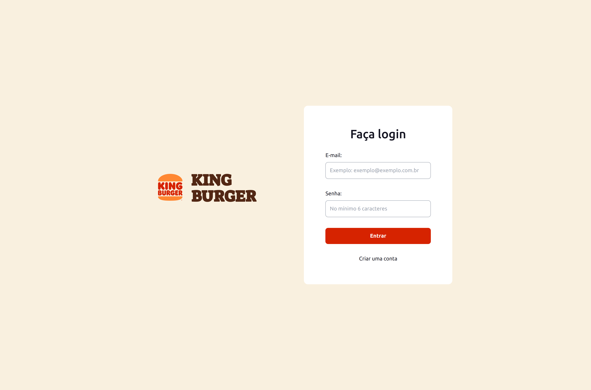
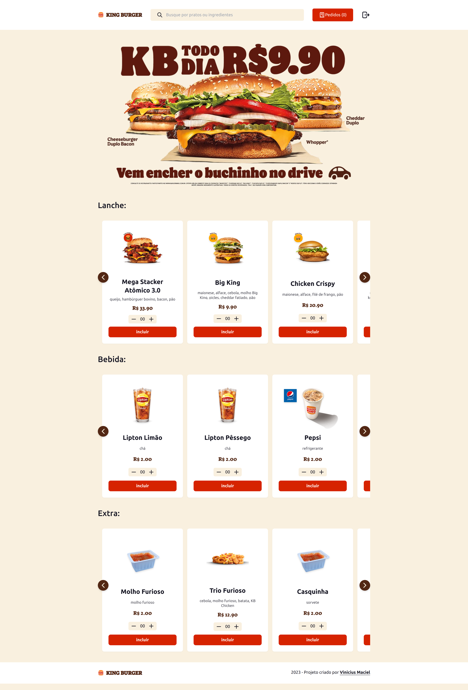
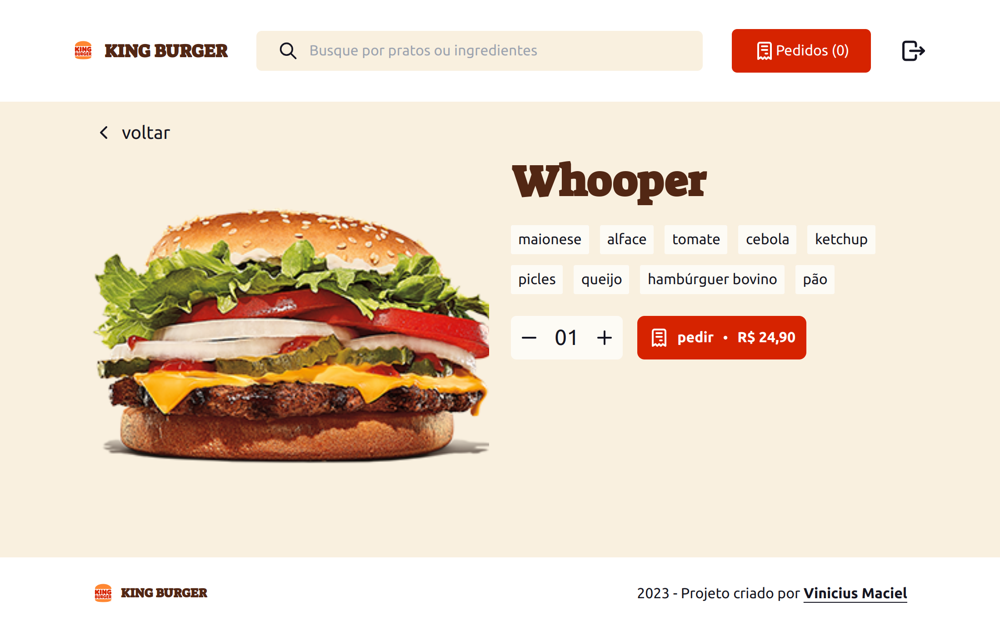

# king-burger

### Backend Repository

The source code for the backend of this project can be found in [this repository](https://github.com/macielvini/king-burger-api). Feel free to check it out for more details.

### Screenshots

  
  
  

